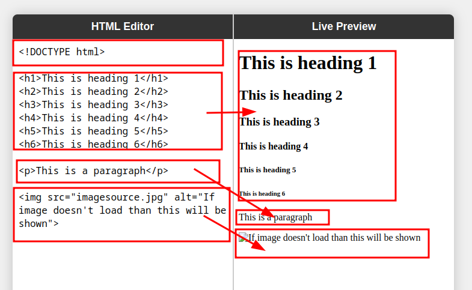

# Basics

## <!DOCTYPE>

Referes Document type, like html, xml.

```
<!DOCTYPE html>
# HTML5 — modern, simple, and the current web standard.

<!DOCTYPE HTML PUBLIC "-//W3C//DTD HTML 4.01//EN" "http://www.w3.org/TR/html4/strict.dtd">
# HTML 4.01 Strict — no deprecated elements, fully standards-compliant.

<!DOCTYPE HTML PUBLIC "-//W3C//DTD HTML 4.01 Transitional//EN" "http://www.w3.org/TR/html4/loose.dtd">
# HTML 4.01 Transitional — allows deprecated elements for compatibility.

<!DOCTYPE HTML PUBLIC "-//W3C//DTD HTML 4.01 Frameset//EN" "http://www.w3.org/TR/html4/frameset.dtd">
# HTML 4.01 Frameset — used when pages rely on frames instead of body tags.

<!DOCTYPE html PUBLIC "-//W3C//DTD XHTML 1.0 Strict//EN" "http://www.w3.org/TR/xhtml1/DTD/xhtml1-strict.dtd">
# XHTML 1.0 Strict — XML-based, disallows deprecated tags and attributes.

<!DOCTYPE html PUBLIC "-//W3C//DTD XHTML 1.0 Transitional//EN" "http://www.w3.org/TR/xhtml1/DTD/xhtml1-transitional.dtd">
# XHTML 1.0 Transitional — XML-based, permits some deprecated elements.

<!DOCTYPE html PUBLIC "-//W3C//DTD XHTML 1.0 Frameset//EN" "http://www.w3.org/TR/xhtml1/DTD/xhtml1-frameset.dtd">
# XHTML 1.0 Frameset — XML-based version designed for frame-based layouts.

<!DOCTYPE html PUBLIC "-//W3C//DTD XHTML 1.1//EN" "http://www.w3.org/TR/xhtml11/DTD/xhtml11.dtd">
# XHTML 1.1 — stricter XML version of HTML, modular and standards-enforced.

```

## Headings

```
<h1>Heading 1</h1>
# The largest and most important heading — usually the main page title.

<h2>Heading 2</h2>
# Second level heading — used for major sections or topics.

<h3>Heading 3</h3>
# Third level heading — used for subsections under an <h2>.

<h4>Heading 4</h4>
# Fourth level heading — for smaller divisions within sections.

<h5>Heading 5</h5>
# Fifth level heading — less prominent, often for sub-subtopics.

<h6>Heading 6</h6>
# The smallest heading — least important, used for fine details.

```

## Paragraphs

```
<p>This is a paragraph.</p>
# Defines a block of text — used to group sentences and create readable content.

```

## Images

```

# Displays an image on the webpage — 'src' specifies the file path, and 'alt' provides alternative text for accessibility or when the image cannot load.

```



