## **Elements and tags**

Those object which implement markup rules

```
<h1>Heading</h1>
# A heading element — defines a title or section header.

<p>This is a paragraph.</p>
# A paragraph element — defines a block of text.

<a href="https://example.com">Visit Example</a>
# A link element — connects to another page or resource.


# An image element — embeds an image (self-closing, no end tag).

```

here `<h1>, <p>, <a>, ` are elements, and starting element and ending elements is seperately known as tag.

## Most usages Tags

```
<!-- Root / Document -->
<!DOCTYPE html>
# Declares the document type as HTML5.

<html lang="en">
# Root element wrapping the entire HTML document.

<head>
# Container for metadata, links, and scripts not shown as page content.

<title>Page Title</title>
# Sets the document’s title shown in the browser tab.

<base href="/" target="_blank">
# Sets the base URL and default link target for relative URLs.

<link rel="stylesheet" href="styles.css">
# Links external resources like stylesheets or icons.

<meta charset="utf-8">
# Provides metadata (character set, viewport, description, etc.).

<style>/* CSS */</style>
# Embeds CSS styles directly in the document.

<body>
# Contains all the content that is rendered on the page.

<!-- Sectioning & Structure -->
<header>
# Introductory content or navigation for a page or section.

<nav>
# Defines a section of navigation links.

<main>
# Represents the dominant content of the document.

<section>
# Thematic grouping of content, typically with a heading.

<article>
# Self-contained, independently distributable content.

<aside>
# Tangential or supplemental content (like sidebars).

<footer>
# Footer for a page or section (authorship, related links, etc.).

<h1>…</h1>
# Top-level heading (use once for main title if possible).

<h2>…</h2>
# Second-level heading for major subsections.

<h3>…</h3>
# Third-level heading for subsections.

<h4>…</h4>
# Fourth-level heading.

<h5>…</h5>
# Fifth-level heading.

<h6>…</h6>
# Sixth-level (smallest) heading.

<hgroup>
# Groups a heading with its subheadings.

<address>
# Contact information for a person, organization, or article.

<!-- Grouping Content -->
<p>…</p>
# Paragraph block of text.

<hr>
# Thematic break between paragraphs or sections.

<pre>…</pre>
# Preformatted text preserving whitespace and line breaks.

<blockquote>…</blockquote>
# Extended quotation, usually with a citation.

<ol>…</ol>
# Ordered (numbered) list.

<ul>…</ul>
# Unordered (bulleted) list.

<li>…</li>
# List item inside ol/ul/menu.

<dl>…</dl>
# Description list of terms and definitions.

<dt>…</dt>
# Term/name in a description list.

<dd>…</dd>
# Description/detail for a term in a description list.

<figure>…</figure>
# Self-contained content, like images or code listings.

<figcaption>…</figcaption>
# Caption or legend for a figure.

<div>…</div>
# Generic container with no semantic meaning.

<!-- Text-Level Semantics -->
<a href="#">…</a>
# Hyperlink to another resource or location.

<em>…</em>
# Emphasized text (typically italics, semantic).

<strong>…</strong>
# Strong importance (typically bold, semantic).

<small>…</small>
# Side comments, fine print, or legal text.

<s>…</s>
# Content that is no longer accurate or relevant.

<cite>…</cite>
# Reference to a creative work (book, article, etc.).

<q>…</q>
# Short inline quotation.

<dfn>…</dfn>
# Term being defined.

<abbr title="…">…</abbr>
# Abbreviation or acronym with optional expansion.

<ruby>…</ruby>
# Ruby annotation container for East Asian typography.

<rb>…</rb>
# Ruby base text.

<rt>…</rt>
# Ruby text (annotation) for pronunciation.

<rtc>…</rtc>
# Ruby text container for complex annotations.

<rp>…</rp>
# Fallback parentheses for browsers not supporting ruby.

<data value="…">…</data>
# Binds a readable value to a machine-readable equivalent.

<time datetime="…">…</time>
# Represents a specific time or date.

<code>…</code>
# Inline code fragment.

<var>…</var>
# Variable in a mathematical expression or programming context.

<samp>…</samp>
# Sample output from a program or system.

<kbd>…</kbd>
# User input or keyboard entry.

<sub>…</sub>
# Subscript text.

<sup>…</sup>
# Superscript text.

<i>…</i>
# Text in an alternate voice/mood (usually italic, non-semantic).

<b>…</b>
# Text offset without extra importance (usually bold, non-semantic).

<u>…</u>
# Text annotation like misspelling or proper name (underlined).

<mark>…</mark>
# Highlighted or marked text of interest.

<bdi>…</bdi>
# Isolates text that might have a different directionality.

<bdo dir="rtl">…</bdo>
# Explicitly overrides the text direction.

<span>…</span>
# Generic inline container with no semantic meaning.

<br>
# Line break within text.

<wbr>
# Optional line-break opportunity.

<!-- Edits -->
<ins>…</ins>
# Inserted content (typically underlined).

<del>…</del>
# Deleted content (typically struck through).

<!-- Embedded Content -->
<picture>…</picture>
# Responsive image container with multiple sources.

<source srcset="…" type="…">
# Media source for picture, audio, or video elements.


# Embeds an image.

<iframe src="…"></iframe>
# Inline frame embedding another HTML page.

<embed src="…">
# Integrates external content (plugin/media).

<object data="…" type="…">…</object>
# Generic container for external resources.

<param name="…" value="…">
# Parameter for an object plugin.

<video controls>…</video>
# Embeds video content.

<audio controls>…</audio>
# Embeds audio content.

<track kind="subtitles" src="…">
# Text tracks (subtitles/captions) for media.

<map name="…">…</map>
# Image map defining clickable areas.

<area shape="…" coords="…" href="…">
# Clickable area inside an image map.

<canvas>…</canvas>
# Scriptable drawing surface for graphics.

<svg>…</svg>
# Embeds SVG vector graphics.

<math>…</math>
# Embeds MathML markup.

<!-- Tables -->
<table>…</table>
# Tabular data container.

<caption>…</caption>
# Table title or description.

<colgroup>…</colgroup>
# Groups columns for shared formatting.

<col span="…">
# Defines properties for a table column.

<thead>…</thead>
# Group of header rows in a table.

<tbody>…</tbody>
# Group of body rows in a table.

<tfoot>…</tfoot>
# Group of footer rows in a table.

<tr>…</tr>
# Table row.

<th scope="col">…</th>
# Header cell in a table.

<td>…</td>
# Data cell in a table.

<!-- Forms -->
<form action="…" method="post">…</form>
# Collects and submits user input.

<label for="…">…</label>
# Caption/label for a form control.

<input type="text">
# Versatile form control for user input.

<button type="button">…</button>
# Clickable button (submit/reset/button).

<select>…</select>
# Drop-down list control.

<datalist>…</datalist>
# Provides autocomplete options for an input.

<optgroup label="…">…</optgroup>
# Groups related <option> items within a select.

<option value="…">…</option>
# Choice within a select, datalist, or menu.

<textarea>…</textarea>
# Multi-line text input control.

<output for="…">…</output>
# Result of a calculation or user action.

<progress value="…" max="…">…</progress>
# Displays task completion progress.

<meter value="…" min="…" max="…">…</meter>
# Scalar measurement within a known range.

<fieldset>…</fieldset>
# Groups related form controls.

<legend>…</legend>
# Caption for a fieldset group.

<!-- Interactive & Disclosures -->
<details>…</details>
# Disclosure widget that users can open and close.

<summary>…</summary>
# Visible heading for a details disclosure.

<dialog>…</dialog>
# Modal or non-modal dialog box.

<!-- Scripting & Templates -->
<script>/* JS */</script>
# Embeds or references executable JavaScript.

<noscript>…</noscript>
# Fallback content when scripts are disabled.

<template>…</template>
# Inactive DOM fragment for client-side templating.

<slot>…</slot>
# Placeholder in Web Components where light DOM is inserted.

```

Code Examkple

```
<!DOCTYPE html>
<html lang="en">
<head>
  <meta charset="utf-8">
  <title>HTML Tag Showcase (Pure HTML)</title>
  <base href="/" target="_blank">
  <link rel="stylesheet" href="styles.css">
  <style></style>
</head>
<body>

<!-- Sectioning & Structure -->
<header>
  <h1>HTML Tag Showcase</h1>
  <nav>
    <a href="#structure">Structure</a>
    <a href="#grouping">Grouping</a>
    <a href="#text">Text</a>
    <a href="#embedded">Embedded</a>
    <a href="#tables">Tables</a>
    <a href="#forms">Forms</a>
    <a href="#interactive">Interactive</a>
    <a href="#scripts">Scripting</a>
  </nav>
</header>

<main id="structure">
  <section>
    <h2>Section Example</h2>
    <article>
      <h3>Article Example</h3>
      <p>This is an article inside a section.</p>
    </article>
    <aside>
      <p>This is an aside with extra info.</p>
    </aside>
  </section>

  <hgroup>
    <h2>Grouped Title</h2>
    <h3>Subtitle in the same group</h3>
  </hgroup>

  <h4>Heading Level 4</h4>
  <h5>Heading Level 5</h5>
  <h6>Heading Level 6</h6>

  <address>
    Contact: Example Org, Dhaka — Email: <a href="mailto:info@example.com">info@example.com</a>
  </address>
</main>

<footer>
  <p>© <time datetime="2025-11-01">2025</time> Example Footer</p>
</footer>

<!-- Grouping Content -->
<section id="grouping">
  <h2>Grouping Content</h2>
  <p>This is a paragraph with <em>emphasis</em> and <strong>strong</strong> text.</p>
  <hr>
  <pre>Preformatted
text keeps    spaces and
line breaks.</pre>
  <blockquote cite="https://example.com">A longer quotation goes here.</blockquote>

  <ol>
    <li>Ordered item 1</li>
    <li>Ordered item 2</li>
  </ol>

  <ul>
    <li>Unordered item A</li>
    <li>Unordered item B</li>
  </ul>

  <dl>
    <dt>HTML</dt>
    <dd>HyperText Markup Language</dd>
  </dl>

  <figure>
    
    <figcaption>Figure with an image and caption.</figcaption>
  </figure>

  <div>Generic div container</div>
</section>

<!-- Text-Level Semantics -->
<section id="text">
  <h2>Text-Level Semantics</h2>

  <p>
    <a href="https://example.com">A hyperlink</a> •
    <small>small print</small> •
    <s>no longer accurate</s> •
    <cite>Work Title</cite> •
    <q>inline quote</q> •
    <dfn>defined term</dfn> •
    <abbr title="World Health Organization">WHO</abbr>
  </p>

  <p>
    <!-- Ruby with rb/rt/rtc/rp -->
    <ruby>
      <rb>漢</rb><rt>hàn</rt>
      <rb>字</rb><rt>zì</rt>
      <rtc><rt>Chinese characters</rt></rtc>
      <rp>(</rp><rt>hanzi</rt><rp>)</rp>
    </ruby>
  </p>

  <p>
    <code>const a = 1;</code> •
    <var>x</var> •
    <samp>program output</samp> •
    <kbd>Ctrl</kbd>+<kbd>S</kbd> •
    H<sub>2</sub>O •
    E = mc<sup>2</sup> •
    <i>alternate voice</i> •
    <b>offset text</b> •
    <u>annotation</u> •
    <mark>highlight</mark> •
    <bdi>abcעברית</bdi> •
    <bdo dir="rtl">Reversed direction</bdo> •
    <span>inline span</span><br>
    Optional<wbr>Break
  </p>

  <p>
    <data value="42">Answer</data> at
    <time datetime="2025-11-01T09:00">9:00 AM</time>.
  </p>

  <!-- Edits -->
  <p><ins>Inserted text</ins> and <del>deleted text</del>.</p>
</section>

<!-- Embedded Content -->
<section id="embedded">
  <h2>Embedded Content</h2>

  <picture>
    <source srcset="https://via.placeholder.com/600x200" media="(min-width: 600px)">
    <source srcset="https://via.placeholder.com/320x160" media="(max-width: 599px)">
    
  </picture>

  <iframe src="https://example.com" title="Example iframe" loading="lazy"></iframe>

  <embed src="https://www.w3.org/WAI/ER/tests/xhtml/testfiles/resources/pdf/dummy.pdf" type="application/pdf">

  <object data="https://via.placeholder.com/150" type="image/png">
    <param name="alt" value="Fallback alt text">
    Fallback content for object.
  </object>

  <video controls width="360">
    <source src="https://interactive-examples.mdn.mozilla.net/media/cc0-videos/flower.mp4" type="video/mp4">
    <track kind="captions" srclang="en" src="https://raw.githubusercontent.com/mdn/learning-area/main/html/multimedia-and-embedding/video-and-audio-content/video-subtitles-en.vtt" label="English">
    Your browser does not support the video tag.
  </video>

  <audio controls>
    <source src="https://interactive-examples.mdn.mozilla.net/media/cc0-audio/t-rex-roar.mp3" type="audio/mpeg">
    Your browser does not support the audio element.
  </audio>

  <map name="demo-map">
    <area shape="rect" coords="0,0,100,50" href="https://example.com" alt="Rect area">
  </map>
  

  <canvas id="cv" width="240" height="80">Canvas fallback text</canvas>

  <svg width="200" height="80" viewBox="0 0 200 80" xmlns="http://www.w3.org/2000/svg" role="img" aria-label="SVG demo">
    <circle cx="40" cy="40" r="30"></circle>
    <text x="80" y="48">SVG Text</text>
  </svg>

  <math xmlns="http://www.w3.org/1998/Math/MathML" display="inline">
    <mrow><mi>E</mi><mo>=</mo><mi>m</mi><msup><mi>c</mi><mn>2</mn></msup></mrow>
  </math>
</section>

<!-- Tables -->
<section id="tables">
  <h2>Tables</h2>
  <table>
    <caption>Sample Table</caption>
    <colgroup>
      <col span="1">
      <col span="1">
    </colgroup>
    <thead>
      <tr><th scope="col">Name</th><th scope="col">Value</th></tr>
    </thead>
    <tbody>
      <tr><td>A</td><td>1</td></tr>
      <tr><td>B</td><td>2</td></tr>
    </tbody>
    <tfoot>
      <tr><td>Total</td><td>3</td></tr>
    </tfoot>
  </table>
</section>

<!-- Forms -->
<section id="forms">
  <h2>Forms</h2>
  <form action="#" method="post">
    <fieldset>
      <legend>Profile</legend>

      <label for="name">Name</label>
      <input id="name" name="name" type="text" placeholder="Your name">

      <label for="bio">Bio</label>
      <textarea id="bio" name="bio" rows="3"></textarea>

      <label for="color">Favorite Color</label>
      <select id="color" name="color">
        <optgroup label="Warm">
          <option value="red">Red</option>
          <option value="orange">Orange</option>
        </optgroup>
        <optgroup label="Cool">
          <option value="blue">Blue</option>
          <option value="green">Green</option>
        </optgroup>
      </select>

      <label for="pets">Pets (datalist)</label>
      <input id="pets" name="pets" list="petlist" placeholder="Type to autocomplete">
      <datalist id="petlist">
        <option value="Cat"></option>
        <option value="Dog"></option>
      </datalist>

      <label>Progress <progress value="70" max="100">70%</progress></label>
      <label>Meter <meter value="0.6" min="0" max="1">0.6</meter></label>

      <output id="out" for="name">Live output</output>

      <div>
        <button type="submit">Submit</button>
        <button type="reset">Reset</button>
        <button type="button">Plain Button</button>
      </div>
    </fieldset>
  </form>
</section>

<!-- Interactive & Disclosures -->
<section id="interactive">
  <h2>Interactive & Disclosures</h2>

  <details>
    <summary>Click to expand details</summary>
    <p>This content is revealed inside details.</p>
  </details>

  <dialog open>
    <p>This is a dialog shown using the <code>open</code> attribute.</p>
    <p><button type="button">Close (no JS)</button></p>
  </dialog>
</section>

<!-- Scripting & Templates -->
<section id="scripts">
  <h2>Scripting & Templates</h2>

  <template id="card-template">
    <div>
      <slot name="title"></slot>
      <slot></slot>
    </div>
  </template>

  <my-card>
    <span slot="title"><strong>Web Component Title</strong></span>
    This is slotted content.
  </my-card>

  <noscript>
    JavaScript is disabled — this appears inside <code>noscript</code>.
  </noscript>

  <script></script>
</section>

</body>
</html>

```


## All HTML 5 Tags With Example

"a" Tag: do ancoring or linking


```
<!-- Basic hyperlink -->
<a href="https://www.example.com">Visit Example</a>

<!-- Link to another page -->
<a href="about.html">About Us</a>

<!-- Open link in a new tab -->
<a href="https://www.example.com" target="_blank">Open in New Tab</a>

<!-- Email link -->
<a href="mailto:info@example.com">Send Email</a>

<!-- Telephone link -->
<a href="tel:+8801742271463">Call Us</a>

<!-- Bookmark link (jump to section on the same page) -->
<a href="#section2">Go to Section 2</a>

```

"abbr" Tag: do abbreviation

```
<!-- Basic abbreviation -->
<abbr title="World Health Organization">WHO</abbr>

<!-- Another example -->
<abbr title="HyperText Markup Language">HTML</abbr>

<!-- In a sentence -->
<p>The <abbr title="Central Processing Unit">CPU</abbr> is the brain of the computer.</p>

```


"address" Tag: mention address

```
<!-- Basic address example -->
<address>
  Written by <a href="mailto:info@example.com">John Doe</a>.<br>
  Visit us at:<br>
  Example Company<br>
  123 Web Street, Dhaka<br>
  Bangladesh
</address>

<!-- Address for a webpage author -->
<address>
  Author: <a href="mailto:author@example.com">Jane Smith</a>
</address>

<!-- Address used in a footer -->
<footer>
  <address>
    Contact: <a href="mailto:support@example.com">support@example.com</a><br>
    456 HTML Avenue, Web City
  </address>
</footer>

```


"area" Tag: do image maping

```
<!-- Basic image map with clickable areas -->


<map name="worldmap">
  <area shape="rect" coords="0,0,100,100" href="https://www.mapsofworld.com/style_2019/images/world-map.png?v:1" alt="Canada">
</map>

<!-- Example with target attribute -->
<area shape="rect" coords="10,10,110,110" href="https://example.com" target="_blank" alt="Example Link">

```


article: mentioning that it's an article

```
<article>
  <h2>Understanding Cybersecurity Basics</h2>
  <p>Cybersecurity is the practice of protecting systems, networks, and programs from digital attacks.</p>
</article>

```


aside: side notes

```
<aside>
  <h2>Did You Know?</h2>
  <p>The first computer virus was created in 1986 and was called the “Brain” virus.</p>
</aside>

```


audio:

```
<audio controls>
  <source src="audio-file.mp3" type="audio/mpeg">
  Your browser does not support the audio element.
</audio>

```


b: bold

```
<p>This is a <b>bold</b> word in a sentence.</p>

```

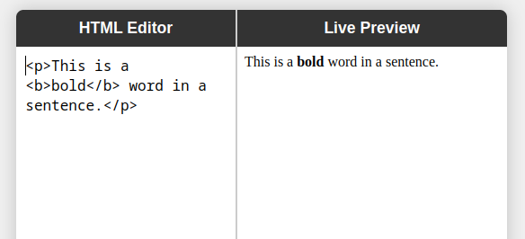

base: define url's base part here, next time just use `/directory/filename.html` etc

```
<head>
  <base href="https://www.example.com/" target="_blank">
</head>

```

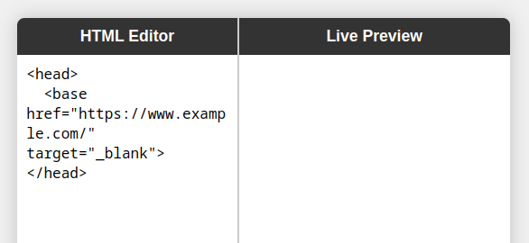


bdi: bidirectional isolation, keep the direction fixed

```
<p>Usernames: <bdi>علي</bdi>, <bdi>John</bdi>, <bdi>Мария</bdi></p>

```

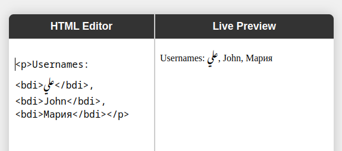

bdo: bidirectional override, force the direction

```
<p><bdo dir="rtl">This text will be displayed from right to left.</bdo></p>

```

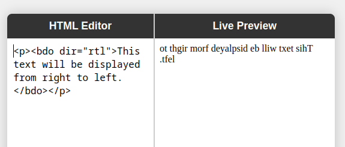

blockquote: quote as a block


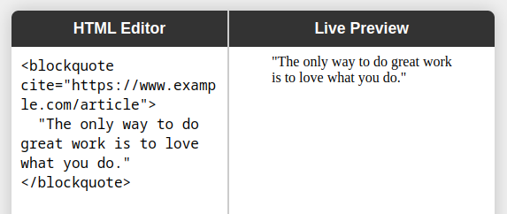

body: document's visible contents lies here 

```
<!DOCTYPE html>
<html lang="en">
<head>
  <title>Body Tag Example</title>
</head>
<body>
  <h1>Welcome to My Web Page</h1>
  <p>This is the main content area inside the body tag.</p>
</body>
</html>

```

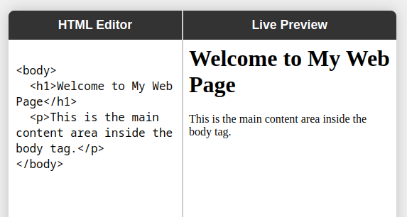

br: breaks line or pressing `Enter`

```
<p>This is the first line.<br>This is the second line.<br>This is the third line.</p>

```

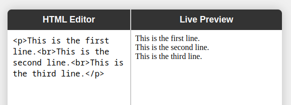

button:

```
<!-- Basic button -->
<button>Click Me</button>

<!-- Submit button inside a form -->
<form action="/submit">
  <button type="submit">Submit</button>
</form>

<!-- Reset button -->
<form>
  <input type="text" placeholder="Enter your name">
  <button type="reset">Reset</button>
</form>

<!-- Button linking to another page -->
<button onclick="window.location.href='https://www.example.com'">Go to Example</button>

```

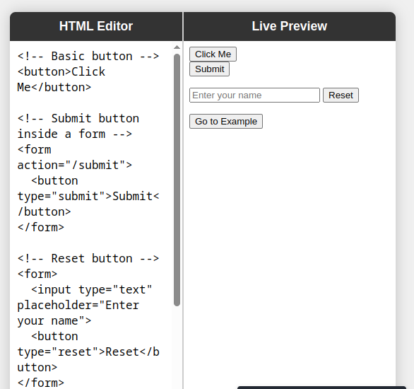

canvas: Region creator

```
<canvas id="myCanvas" width="200" height="100">
  Your browser does not support the canvas element.
</canvas>

```

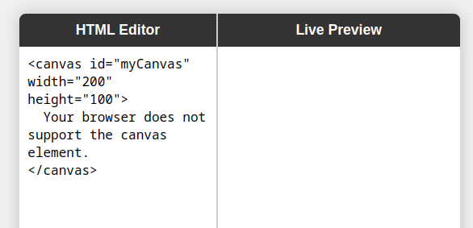

caption: like title 

```
<table border="1">
  <caption>Monthly Sales Report</caption>
  <tr>
    <th>Month</th>
    <th>Sales</th>
  </tr>
  <tr>
    <td>January</td>
    <td>$5,000</td>
  </tr>
</table>

```

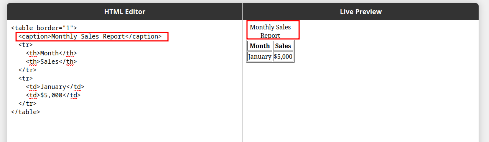

cite: to do citation

```
<p><cite>The Art of War</cite> by Sun Tzu is a timeless book on strategy.</p>

```

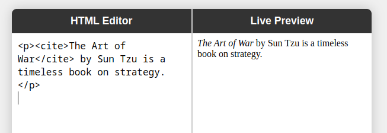

code: showing as a code 

```
<p>To display a message in JavaScript, use <code>console.log("Hello, World!");</code></p>

```

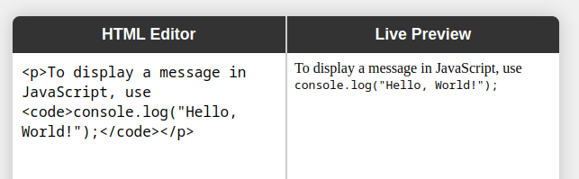

col: column

```
<table border="1">
  <colgroup>
    <col style="background-color: lightblue;">
    <col style="background-color: lightgreen;">
  </colgroup>
  <tr>
    <th>Name</th>
    <th>Age</th>
  </tr>
  <tr>
    <td>John</td>
    <td>25</td>
  </tr>
</table>

```


colgroup: column grouping

```
<table border="1">
  <colgroup>
    <col style="background-color: lightblue;">
    <col style="background-color: lightgreen;">
    <col style="background-color: lightyellow;">
  </colgroup>
  <tr>
    <th>Product</th>
    <th>Price</th>
    <th>Stock</th>
  </tr>
  <tr>
    <td>Laptop</td>
    <td>$800</td>
    <td>Available</td>
  </tr>
</table>

```

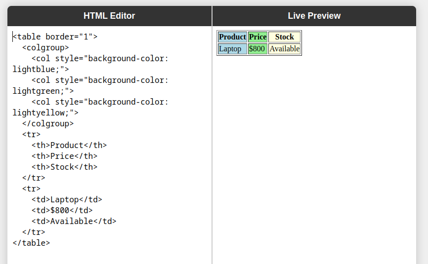

data: for machine

```
<p>The product <data value="101">Laptop</data> is currently in stock.</p>

```

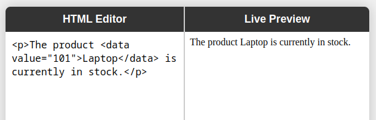

datalist: giving option to choose

```
<form>
  <label for="browser">Choose your browser:</label>
  <input list="browsers" id="browser" name="browser">

  <datalist id="browsers">
    <option value="Google Chrome">
    <option value="Mozilla Firefox">
    <option value="Microsoft Edge">
    <option value="Safari">
    <option value="Opera">
  </datalist>
</form>

```

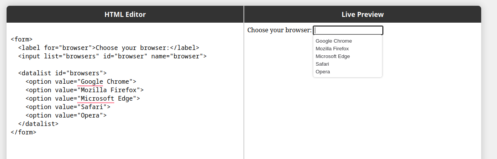

dd: definition

```
<dl>
  <dt>HTML</dt>
  <dd>HyperText Markup Language — the standard language for creating web pages.</dd>

  <dt>CSS</dt>
  <dd>Cascading Style Sheets — used for designing and formatting web pages.</dd>
</dl>

```

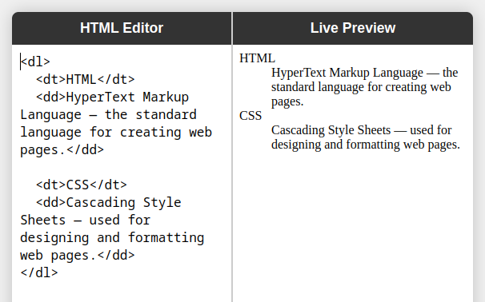

del: deleted

```
<p>The old price was <del>$100</del> now it's <ins>$80</ins>.</p>

```

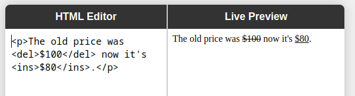

details: toogle menue like

```
<details>
  <summary>What is HTML?</summary>
  <p>HTML stands for HyperText Markup Language. It is used to structure content on the web.</p>
</details>

```

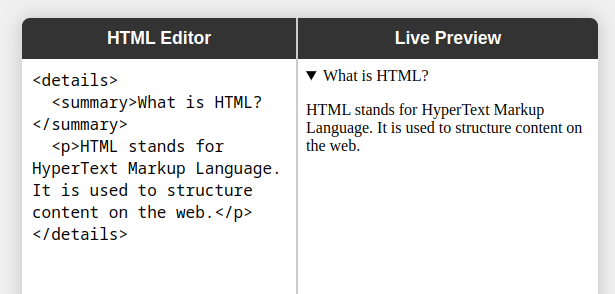

dfn: inline define term


```
<p><dfn>Phishing</dfn> is a type of cyber attack where attackers trick users into revealing sensitive information.</p>

```

dialog: dialogue window

```
<dialog open>
  <h2>Welcome!</h2>
  <p>This is a simple dialog box.</p>
  <button>Close</button>
</dialog>

```

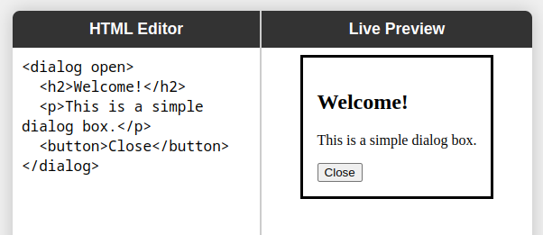

div: division for grouping

```
<div>
  <h2>Welcome to My Website</h2>
  <p>This section is grouped inside a div element.</p>
</div>

```


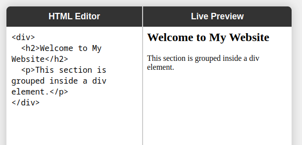

dl: descriiptive list

```
<dl>
  <dt>HTML</dt>
  <dd>HyperText Markup Language — the standard language for creating web pages.</dd>

  <dt>CSS</dt>
  <dd>Cascading Style Sheets — used to design and format web pages.</dd>

  <dt>JavaScript</dt>
  <dd>A programming language used to make web pages interactive.</dd>
</dl>

```

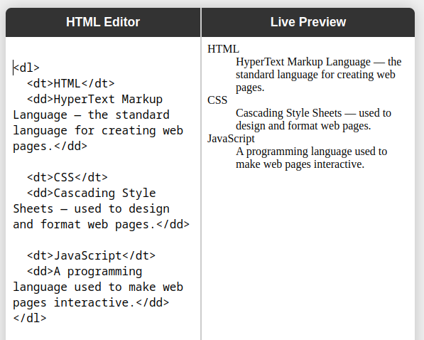

dt: description term

```
<dl>
  <dt>HTML</dt>
  <dd>HyperText Markup Language — the standard language for creating web pages.</dd>

  <dt>CSS</dt>
  <dd>Cascading Style Sheets — used for styling and layout of web pages.</dd>
</dl>

```


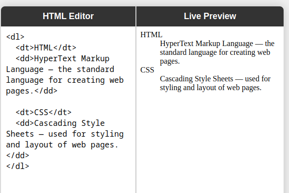

em: emphasize

```
<p>Learning <em>cybersecurity</em> requires both theory and practical experience.</p>

```


embed: to embed

```
<embed src="https://www.dcpehvpm.org/E-Content/BCA/BCA-II/Web%20Technology/the-complete-reference-html-css-fifth-edition.pdf" type="application/pdf" width="600" height="400">

```

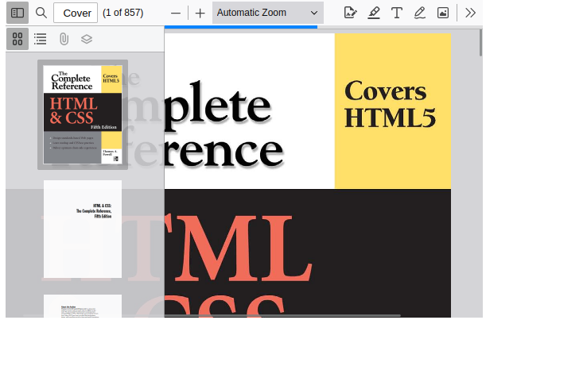

fieldset: grouping html form's tags

```
<form>
  <fieldset>
    <legend>Personal Information</legend>

    <label for="name">Name:</label>
    <input type="text" id="name" name="name"><br><br>

    <label for="email">Email:</label>
    <input type="email" id="email" name="email"><br><br>

    <button type="submit">Submit</button>
  </fieldset>
</form>

```


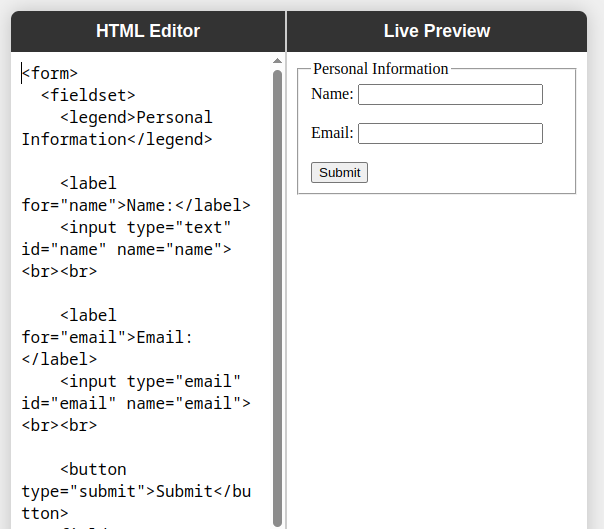

figcaption: defines figure

```
<figure>
  
  <figcaption>Sunset over the Himalayas — captured in autumn 2025.</figcaption>
</figure>

```

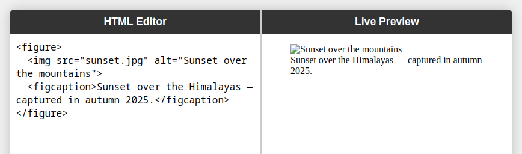


figure: for grouping figure

```
<figure>
  
  <figcaption>Illustration showing the concept of cybersecurity protection.</figcaption>
</figure>

```

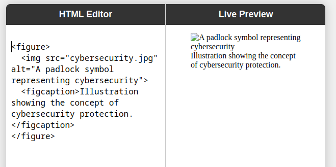

footer: bottom part

```
<footer>
  <p>© 2025 OffSecPractitioner. All rights reserved.</p>
  <p>Contact: <a href="mailto:info@example.com">info@example.com</a></p>
</footer>

```


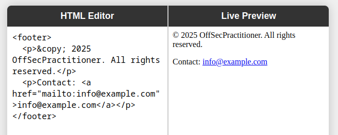

form: building form

```
<form action="/submit" method="post">
  <label for="name">Name:</label>
  <input type="text" id="name" name="name"><br><br>

  <label for="email">Email:</label>
  <input type="email" id="email" name="email"><br><br>

  <button type="submit">Submit</button>
</form>

```

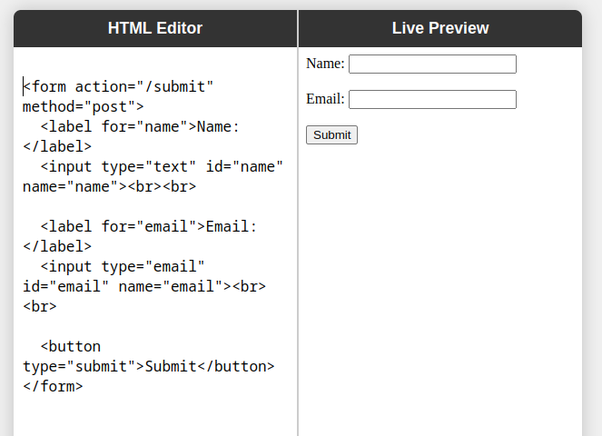

h1-6:

```
<h1>This is a Heading 1</h1>
<h2>This is a Heading 2</h2>
<h3>This is a Heading 3</h3>
<h4>This is a Heading 4</h4>
<h5>This is a Heading 5</h5>
<h6>This is a Heading 6</h6>

```


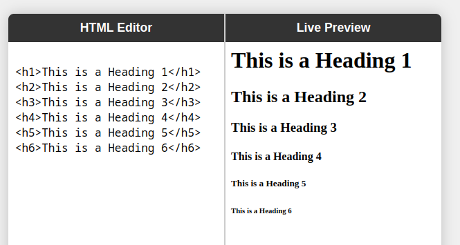

head: contain metadata, not visible publickly

```
<!DOCTYPE html>
<html lang="en">
<head>
  <meta charset="UTF-8">
  <meta name="viewport" content="width=device-width, initial-scale=1.0">
  <title>Head Tag Example</title>
  <link rel="stylesheet" href="styles.css">
</head>
<body>
  <h1>Content goes here</h1>
</body>
</html>

```


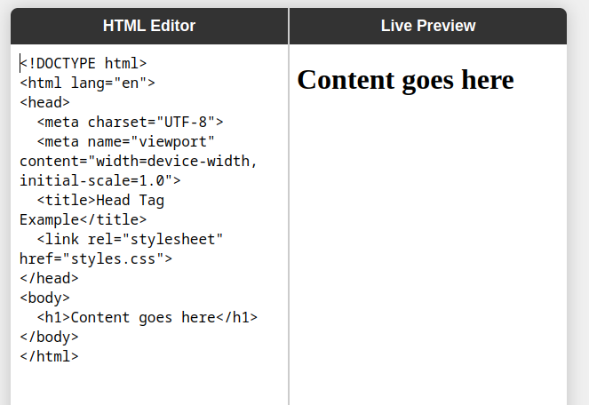

header: intro

```
<header>
  <h1>OffSec Practitioner</h1>
  <p>Empowering the next generation of ethical hackers.</p>
  <nav>
    <a href="#home">Home</a> |
    <a href="#courses">Courses</a> |
    <a href="#contact">Contact</a>
  </nav>
</header>

```


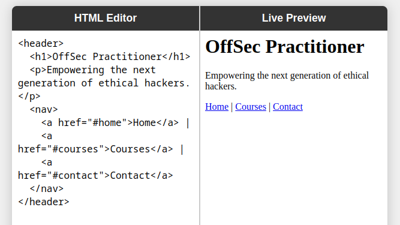

hr: seperator line 


```
<h2>Introduction</h2>
<p>This course will teach you the fundamentals of web security.</p>

<hr>

<h2>Next Steps</h2>
<p>Once you complete this section, you’ll move on to advanced topics.</p>

```

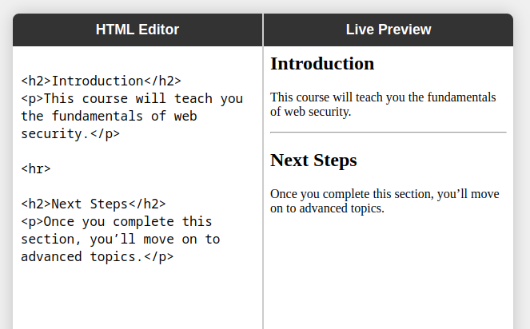

html: wrap everything

```
<!DOCTYPE html>
<html lang="en">
<head>
  <meta charset="UTF-8">
  <title>HTML Tag Example</title>
</head>
<body>
  <h1>Hello, World!</h1>
  <p>This webpage is wrapped inside the HTML tag.</p>
</body>
</html>

```

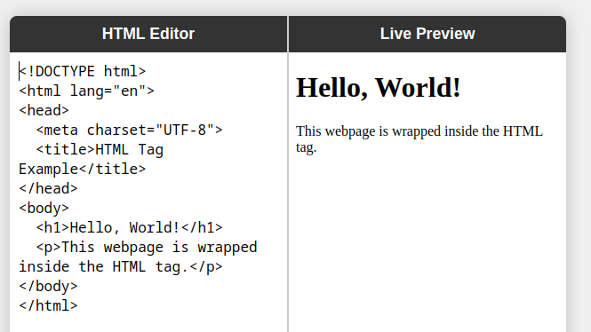

i: italic

```
<p>The word <i>hacker</i> originally meant someone who loves exploring technology.</p>

```

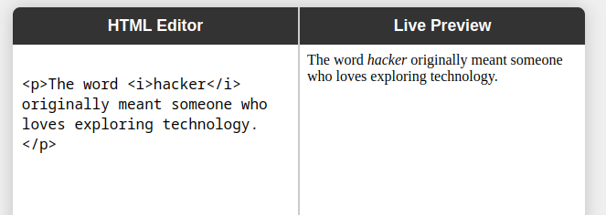

iframe: embed another webpage

```
<iframe src="https://www.example.com" width="600" height="400" title="Example Website">
  Your browser does not support iframes.
</iframe>

```

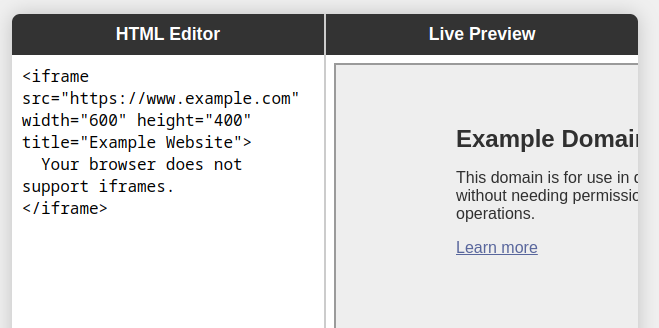


img:

```


```

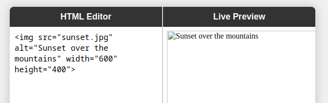


input:

```
<form>
  <label for="username">Username:</label>
  <input type="text" id="username" name="username" placeholder="Enter your name">
</form>

```

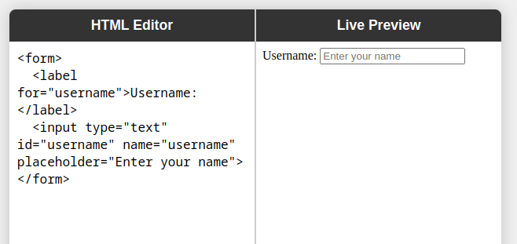

ins: inserted

```
<p>The course fee was <del>$250</del> now it’s <ins>$200</ins>.</p>

```

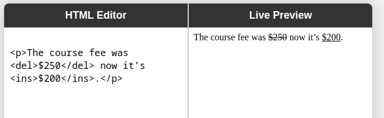

kbd: keyboard key

```
<p>To refresh the page, press <kbd>Ctrl</kbd> + <kbd>R</kbd>.</p>

```

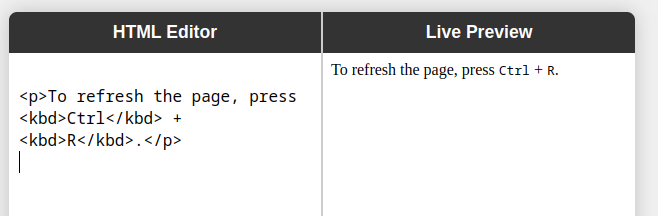

label:

```
<form>
  <label for="email">Email:</label>
  <input type="email" id="email" name="email" placeholder="Enter your email">
</form>

```

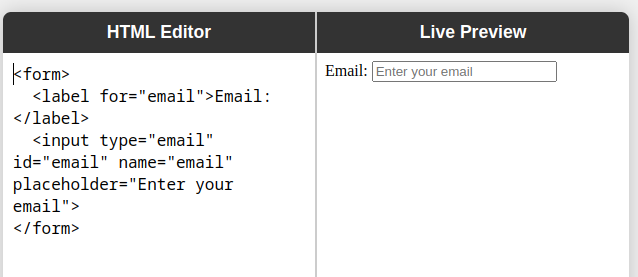


legend


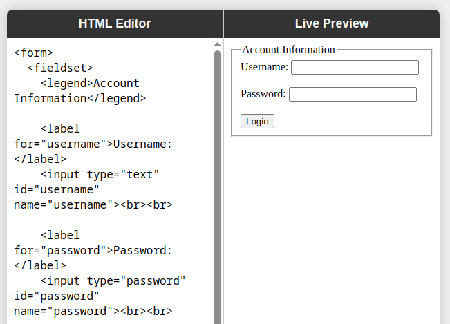

li:

```
<ul>
  <li>Learn HTML</li>
  <li>Practice CSS</li>
  <li>Build a portfolio</li>
</ul>

<ol>
  <li>Download resources</li>
  <li>Watch tutorials</li>
  <li>Start coding</li>
</ol>

```


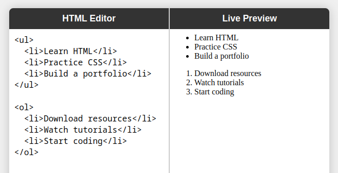


link


```
<head>
  <link rel="stylesheet" href="styles.css">
</head>

```


main

```
<main>
  <h1>Welcome to OffSec Practitioner</h1>
  <p>Our mission is to train elite cybersecurity professionals through real-world practice and mentorship.</p>
</main>

```

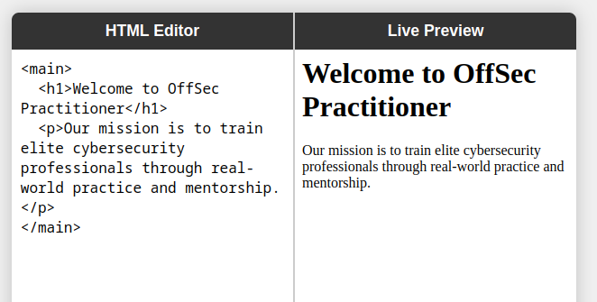

map: image mapping

```


<map name="worldmap">
  <area shape="rect" coords="34,44,270,350" href="https://en.wikipedia.org/wiki/North_America" alt="North America">
  <area shape="circle" coords="400,200,60" href="https://en.wikipedia.org/wiki/Europe" alt="Europe">
</map>

```

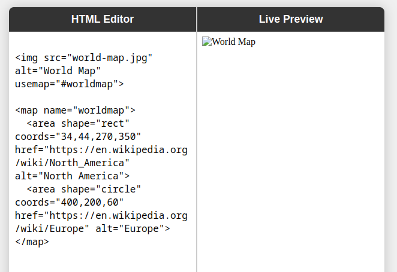

mark: marking

```
<p>Learning <mark>ethical hacking</mark> can help you understand how to protect systems better.</p>

```

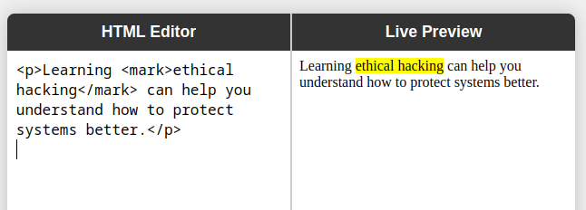

math: math equation

```
<math xmlns="http://www.w3.org/1998/Math/MathML">
  <mrow>
    <msup><mi>E</mi><mn>2</mn></msup>
    <mo>=</mo>
    <msup><mi>m</mi><mn>2</mn></msup>
    <msup><mi>c</mi><mn>4</mn></msup>
  </mrow>
</math>

```

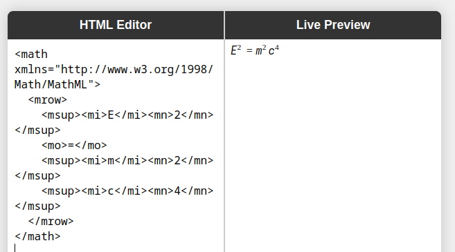

menu: Menu


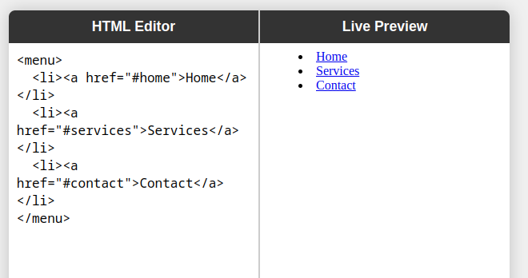


meta:


```
<head>
  <meta charset="UTF-8">
  <meta name="description" content="Learn ethical hacking and OSINT investigation from professionals.">
  <meta name="keywords" content="Cybersecurity, OSINT, Ethical Hacking, OffSecPractitioner">
  <meta name="author" content="Saide">
  <meta name="viewport" content="width=device-width, initial-scale=1.0">
</head>

```


meter:


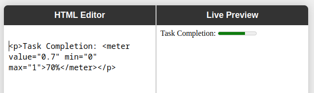

nav: navigation 


```
<nav>
  <ul>
    <li><a href="#home">Home</a></li>
    <li><a href="#about">About</a></li>
    <li><a href="#services">Services</a></li>
    <li><a href="#contact">Contact</a></li>
  </ul>
</nav>

```

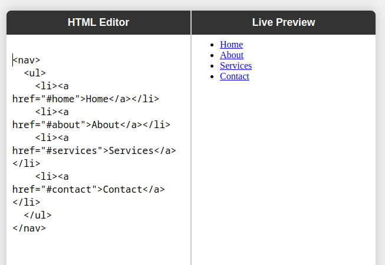

noscript: note for those whos browser doesn't support script


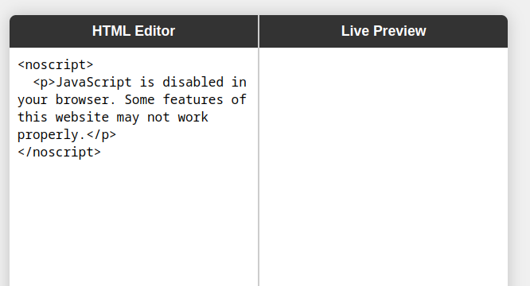

object: embed object


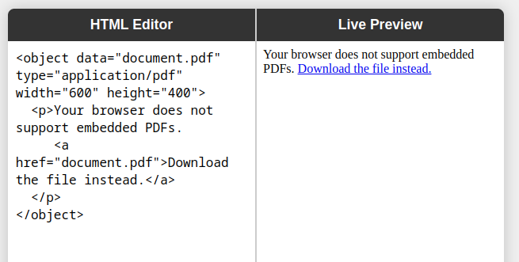

ol:


optgroup: groping option

```
<label for="course">Choose a course:</label>
<select id="course" name="course">
  <optgroup label="Offensive Security">
    <option value="web-pentest">Web Penetration Testing</option>
    <option value="network-pentest">Network Penetration Testing</option>
  </optgroup>
  <optgroup label="OSINT">
    <option value="basic-osint">OSINT Fundamentals</option>
    <option value="adv-osint">Advanced OSINT Techniques</option>
  </optgroup>
</select>

```

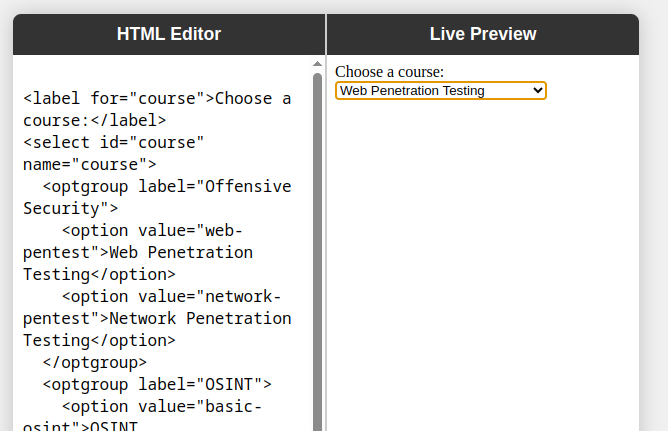

option: option to choose

```
<label for="language">Choose a language:</label>
<select id="language" name="language">
  <option value="html">HTML</option>
  <option value="css">CSS</option>
  <option value="javascript">JavaScript</option>
</select>

```

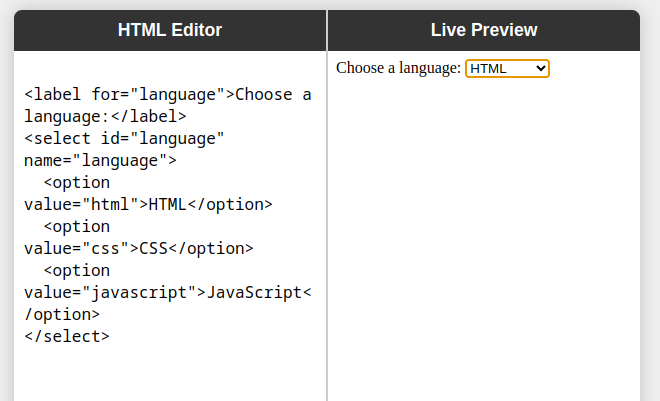

p: paragraph


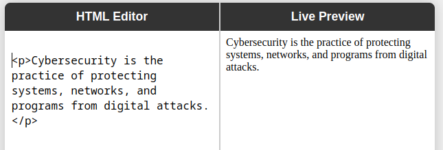


picture

```
<picture>
  <source srcset="image-large.jpg" media="(min-width: 800px)">
  <source srcset="image-medium.jpg" media="(min-width: 500px)">
  
</picture>

```


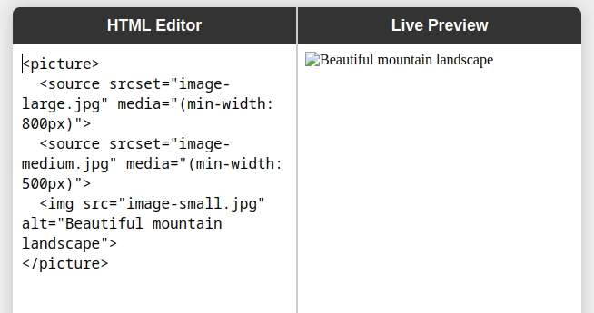

pre: as it is

```
<pre>
Line 1
  Line 2 (indented)
    Line 3 (more indented)
</pre>

```

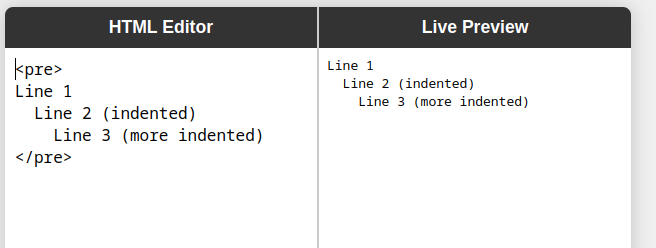


progress

```
<label for="file">File upload:</label>
<progress id="file" value="45" max="100">45%</progress>

```


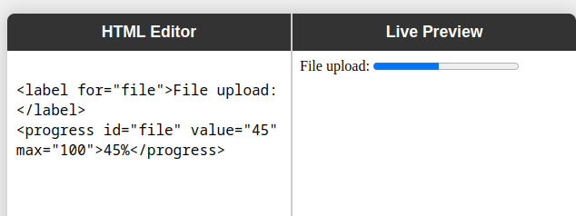

q:

```
<p>She said, <q>Practice makes perfect.</q></p>

```


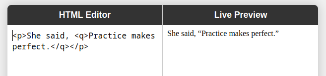

ruby, rb, rt, rtc:

```
<ruby>
  漢 <rt>kan</rt>
  字 <rt>ji</rt>
</ruby>

```

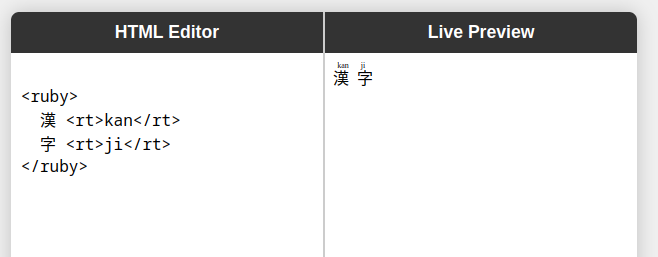


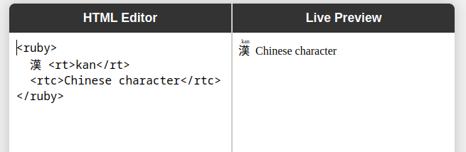

s: strike

```
<p>This item was <s>$100</s> now only $75!</p>

```

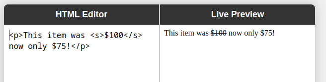

samp:

```
<p>System message: <samp>File not found</samp></p>

```


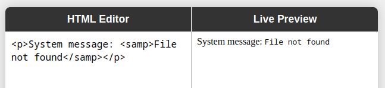

search:

```
<search>
  <form action="/search">
    <input type="search" name="q" placeholder="Search..." />
    <button type="submit">Go</button>
  </form>
</search>

```


section:


```
<section>
  <h2>About Us</h2>
  <p>We provide professional offensive security and OSINT services worldwide.</p>
</section>

```

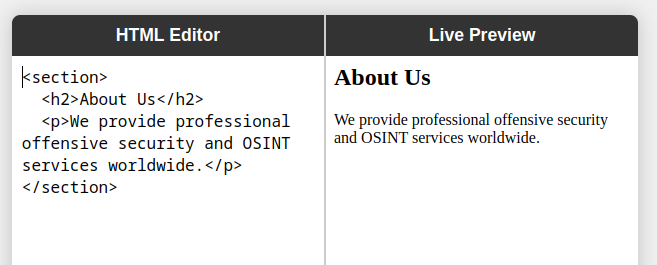

select:

```
<label for="language">Choose a language:</label>
<select id="language" name="language">
  <option value="html">HTML</option>
  <option value="css">CSS</option>
  <option value="javascript">JavaScript</option>
</select>

```

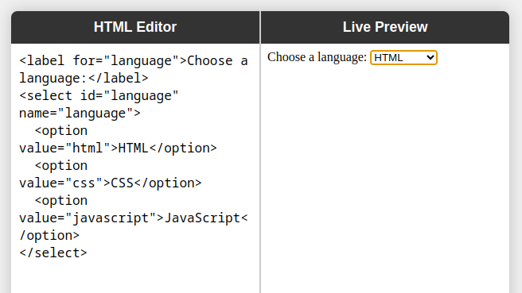


small

```
<p>Terms and conditions apply. <small>Offer valid until December 31, 2025.</small></p>

```

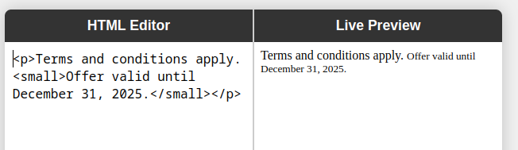


source

```
<video controls>
  <source src="movie.mp4" type="video/mp4">
  <source src="movie.webm" type="video/webm">
  Your browser does not support the video tag.
</video>

```

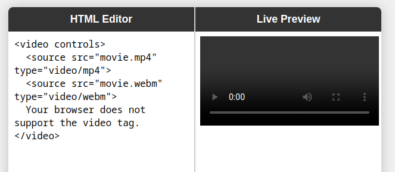

span: inline div

```
<p>This is a <span style="color: red;">red</span> word.</p>

```

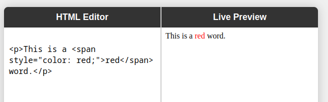

strong

```
<p>Always <strong>verify</strong> before you trust.</p>

```

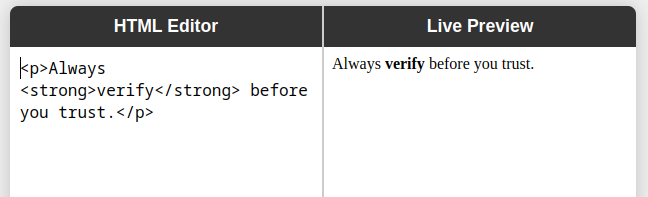


sub, sup

```
<p>Water formula: H<sub>2</sub>O</p>
<p>Square value: x<sup>2</sup></p>

```

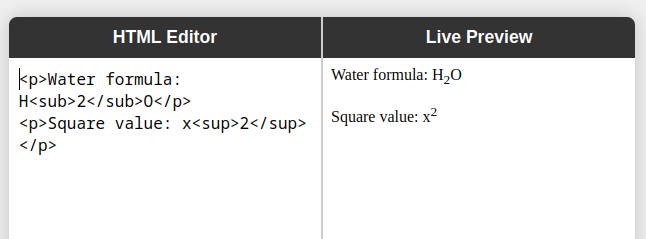

svg: graphics

```
<!-- SVG Examples -->
<svg width="120" height="120">
  <circle cx="60" cy="60" r="50" fill="lightgray" stroke="black" stroke-width="2" />
</svg>

<svg viewBox="0 0 24 24" width="24" height="24" aria-label="check">
  <path d="M20 6L9 17l-5-5" fill="none" stroke="currentColor" stroke-width="2" />
</svg>

<svg width="200" height="60">
  <rect width="200" height="60" rx="8" ry="8" fill="#eef" />
  <text x="100" y="38" text-anchor="middle" font-size="20">Hello SVG</text>
</svg>

```


table, tbody,td:

```
<table border="1">
  <tbody>
    <tr>
      <td>Name</td>
      <td>Role</td>
    </tr>
    <tr>
      <td>Parves</td>
      <td>Security Researcher</td>
    </tr>
    <tr>
      <td>Noyon</td>
      <td>Founder</td>
    </tr>
  </tbody>
</table>

```

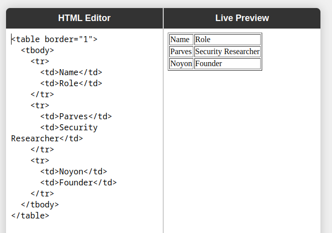

textarea

```
<label for="message">Your Message:</label><br>
<textarea id="message" name="message" rows="4" cols="40" placeholder="Type your message here..."></textarea>

```

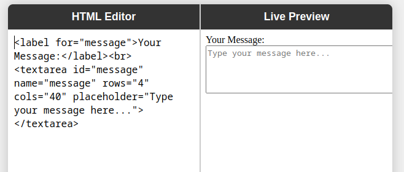

time:

```
<p>Meeting scheduled at <time datetime="2025-11-01T14:00">2:00 PM, Nov 1, 2025</time>.</p>
```

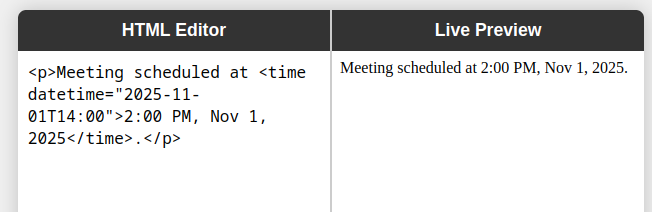
