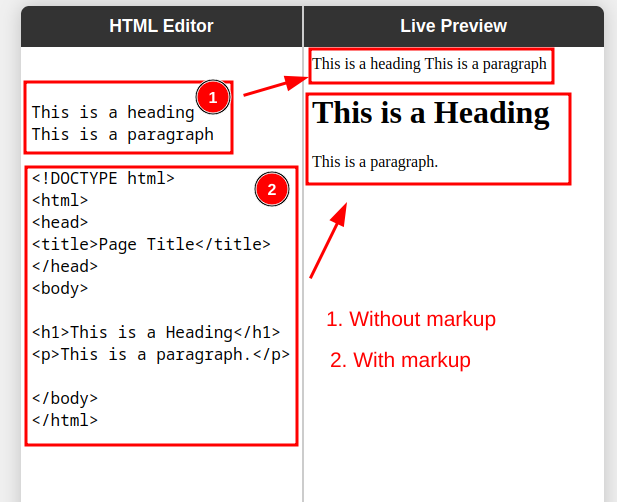

# HTML Notes
Learn HTML with me. Here are my notes.

[Pure HTML Editor](https://saideoffsec.github.io/html)

**HTML** is a markup language, or text formating language, which define text how it will look like or it's a way fo writing text in different format.

I think, **HTML** is a set of rules to modify text formating.

Here is the topic lists to learn to master HTML:

1. HTML Introduction
2. HTML Basic
3. HTML Elements
4. HTML Attributes
5. HTML Headings
6. HTML Paragraphs
7. HTML Styles
8. HTML Formatting
9. HTML Quotations
10. HTML Comments
11. HTML Colors
12. HTML CSS
13. HTML Links
14. HTML Images
15. HTML Favicon
16. HTML Page Title
17. HTML Tables
18. HTML Lists
19. HTML Block & Inline
20. HTML Div
21. HTML Classes
22. HTML Id
23. HTML Iframes
24. HTML JavaScript
25. HTML File Paths
26. HTML Head
27. HTML Layout
28. HTML Responsive
29. HTML Computercode
30. HTML Semantics
31. HTML Style Guide
32. HTML Entities
33. HTML Symbols
34. HTML Emojis
35. HTML Charsets
36. HTML URL Encode
37. HTML vs. XHTML

    1. HTML Forms
    2. HTML Form Attributes
    3. HTML Form Elements
    4. HTML Input Types
    5. HTML Input Attributes
    6. Input Form Attributes
38. HTML Graphics

    1. HTML Canvas
    2. HTML SVGHTML Media
39. HTML Media

    1. HTML Video
    2. HTML Audio
    3. HTML Plug-ins
    4. HTML YouTube
40. HTML APIs

    1. HTML Web APIs
    2. HTML Geolocation
    3. HTML Drag and Drop
    4. HTML Web Storage
    5. HTML Web Workers
    6. HTML SSE
41. HTML Examples

    1. HTML Examples
    2. HTML Editor
    3. HTML Quiz
    4. HTML Exercises
    5. HTML Website
    6. HTML Syllabus
    7. HTML Study Plan
    8. HTML Interview Prep
    9. HTML Bootcamp
    10. HTML Certificate
    11. HTML Summary
    12. HTML Accessibility
42. HTML References

    1. HTML Tag List
    2. HTML Attributes
    3. HTML Global Attributes
    4. HTML Browser Support
    5. HTML Events
    6. HTML Colors
    7. HTML Canvas
    8. HTML Audio/Video
    9. HTML Doctypes
    10. HTML Character Sets
    11. HTML URL Encode
    12. HTML Lang Codes
    13. HTTP Messages
    14. HTTP Methods
    15. PX to EM Converter
    16. Keyboard Shortcuts
   

